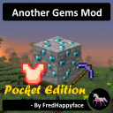

<p float="left">
<a href="../../"></a>
<a href="https://www.codacy.com/manual/FredHappyface/MinecraftPE.AnotherGemsMod"></a>
<a href="https://www.codacy.com/manual/FredHappyface/MinecraftPE.AnotherGemsMod"></a>
<a href="../../"></a>
<a href="../../issues"></a>
<a href="/LICENSE.md"></a>
<a href="../../commits/master"></a>
<a href="../../commits/master"></a>
</p>

# MinecraftPE.AnotherGemsMod



- By FredHappyface

New in 2019.08.06
- Lamps and Inverted Lamps 

This mod includes some world gen, gems with various properties and recipes for various tools and armour. Adds some decoration blocks that can be crafted from the gems too: block of gem and bricks. This is a first stab at a MinecraftPE mod and is based on Minecraft.AnotherGemsMod https://github.com/FredHappyface/Minecraft.AnotherGemsMod

Get it at https://icmods.mineprogramming.org/mod.php?id=421
alternatively, you can build the project from source

## Crafting Recipes 

Crafting recipes are as in the Java Edition 

### Decoration Blocks

Block 

Bricks

Lamp 

Inverted Lamp


### Tools 

Hoe 

Shovel 

Sword

Axe 

Pickaxe 

Shears 


### Armor 

Helm

Chest-piece

Leggings 

Boots 


## A note on versions 
- Alpha: Considered unstable, updating versions may affect existing worlds, blocks/ items will be without textures. Introduces new features
- Beta: Considered stable with some testing, blocks/ items should all have textures and recipes potentially with few exceptions. Expect fewer new features from alpha
- Release: Stable and more thoroughly tested, considered acceptable quality for general usage. Bug fixes from beta 

## Download
### Clone
#### Using The Command Line 
1. Press the Clone or download button in the top right
2. Copy the URL (link)
3. Open the command line and change directory to where you wish to clone to
4. Type 'git clone' followed by URL in step 2
```bash
$ git clone https://github.com/[user-name]/[repository]
```

More information can be found at https://help.github.com/en/articles/cloning-a-repository 

#### Using GitHub Desktop
1. Press the Clone or download button in the top right
2. Click open in desktop
3. Choose the path for where you want and click Clone

More information can be found at https://help.github.com/en/desktop/contributing-to-projects/cloning-a-repository-from-github-to-github-desktop 

### Download Zip File

1. Download this GitHub repository
2. Extract the zip archive
3. Copy/ move to the desired location


## Licence 
MIT License
Copyright (c) Kieran W
(See the [LICENSE](/LICENSE.md) for more information.)

